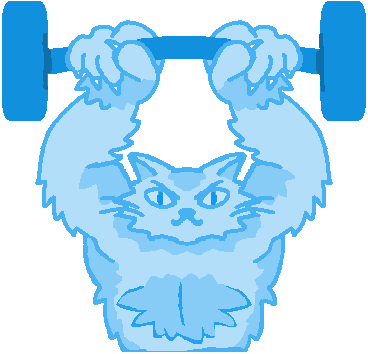

# Workout Tracker

### A simple tracker of workouts!

### Demo
Coming soon...

### Getting Started
Clone the repo:
```bash
$ git clone https://github.com/redawl/Workout-Tracker.git
```

Build and start the application:
```bash
$ ./scripts/run-dev.sh
```

That's it!